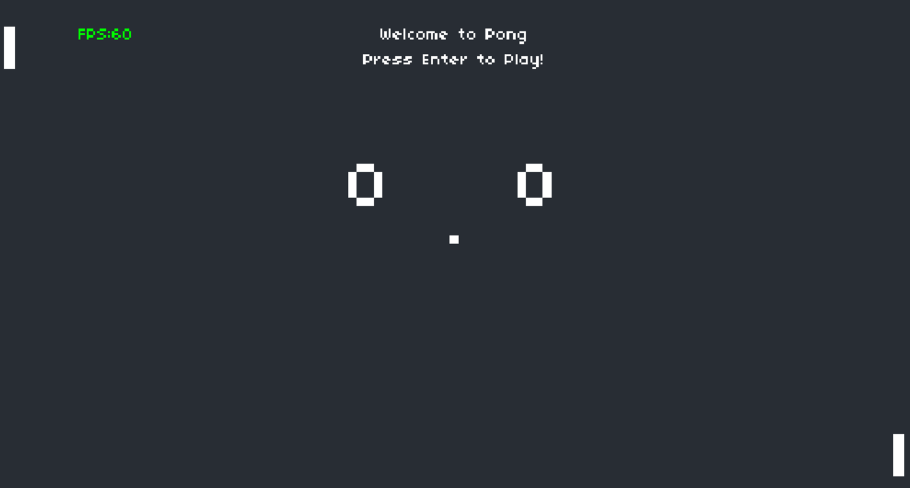
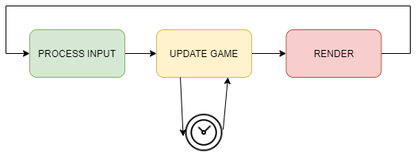
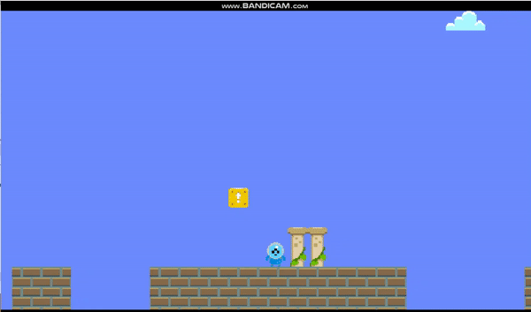
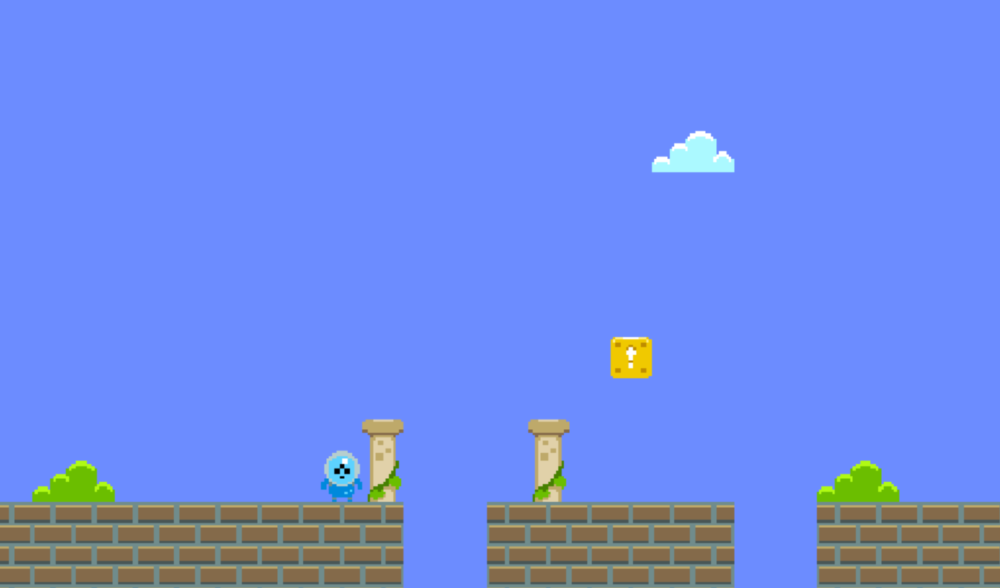

# Games
Quick Games made in __Lua with L‎ÖVE__, based on __CS50 Class (Fall 2020, led by Colton Ogen @Harvard)__

Both games are created in Lua, the flexible, light-weight scripting language focused around tables.
 
L‎ÖVE was used as a fast 2-D game development framework, which provides modules for graphics, math, audio, etc.

## Pong
* Replication of a quick PONG game

* Download **PongH.exe** and play it!
 

* __*Concepts Covered*__
* Velocity and Delta Time
    * Delta Time ("amount of time passed since the last frame") used to "normalize" the game speed regardless of the different frame rates across computers
* Game State  

* Object-Oriented Programming
    * Class introduced to manage relevant codes better and cleaner!
* Box Collision (HitBoxes, Bounding Boxes)
    * Collision of elements are detected using "AABB(Axis-Aligned Bounding Boxes) Collision Detection" Theory
        * "If opposite edges are apart, no collision happening." 
* Sound Effects (w/ Bfxr)
    * Used Bfxr to generate simple game sounds and included them as audio files
 

## Mario
* Replication of a Super Mario stage and movement
* Made just for learning purpose, improvements needed

 

* __*Concepts Covered*__
* Spritesheets & Raster Graphics
    * Spritesheets are "images of smaller images or animation", or "Texture atlas".
    * Raster Graphics are "dot matrix data structures that represent rectangular grid of pixels or points of color"
* Tile Maps
    * "data representation of a grid of tiles to be rendered to the screen"
* Gravity
    * Applying specific Y velocity to the avatar
* Animation
    * Sprite Animation: current frame sprite is swapped with another frame, depending on how much time has elapsed and what that sprite animation interval is.
   
